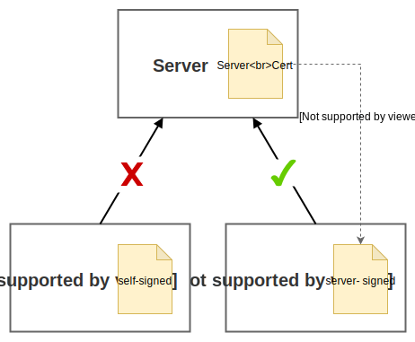

# Client Certificate Authentication (mTLS) with Node.js

This is demo on how to do client authentication with certificates, **mTLS or mutual TLS** - as opposed to username and passwords with out of the box (OOTB) Node.js.

This demo has a server with two clients:

- "Alice" who has a server-signed trusted certificate
- "Bob" who has an invalid self-signed certificate



Based on the following tutorials:

- [Authentication using HTTPS client certificates](https://medium.com/@sevcsik/authentication-using-https-client-certificates-3c9d270e8326)  
	Author: Andras Sevcsik-Zajácz, Web technology enthusiast

- [HTTPS Authorized Certs with Node.js](https://engineering.circle.com/https-authorized-certs-with-node-js-315e548354a2)  
	Author: Anders Brownworth, Rethinking money @CirclePay | Co-taught the Blockchain class at MIT

# Demo: How to Use

First install required dependencies with `npm install`. Then the demo works as follows:

## Step 1 - Start Server

We start a sever that by default only accepts requests authenticated by client certificates

```
npm run server
```

You can test this is working by opening [https://localhost:4433/](https://localhost:4433/) in your browser. 

## Step 2 - Test Valid Client (Alice)

**Alice** has a valid certificate issued by server, so she can talk to the server:

```
$ npm run valid-client

> node ./client/valid-app.js

Hello Alice, your certificate was issued by localhost!
```

## Step 3 - Test Invalid Client (Bob)

**Bob** has a self-issued certificate, which is rejected by the server:

```
$ npm run invalid-client

> node ./client/invalid-app.js

Sorry Bob, certificates from Bob are not welcome here.
```


# Reference - Introduction to Creating Certificates

## Server Certificates

- CN: localhost
- O: Client Certificate Demo

```bash
openssl req \
	-x509 \
	-newkey rsa:4096 \
	-keyout server/server_key.pem \
	-out server/server_cert.pem \
	-nodes \
	-days 365 \
	-subj "/CN=localhost/O=Client\ Certificate\ Demo"
```

This command shortens following _three_ commands:

- `openssl genrsa` 
- `openssl req`
- `openssl x509`

which generates _two_ files:

- `server_cert.pem`
- `server_key.pem`

## Create Client Certificates

For demo, two users are created:

- Alice, who has a valid certificate, signed by the server
- Bob, who creates own certificate, self-signed


### Create Alice's Certificate (server-signed and valid)

We create a certificate for Alice.

- sign alice's Certificate Signing Request (CSR)...
- with our server key via `-CA server/server_cert.pem` and
	`-CAkey server/server_key.pem` flags
- and save results as certificate

```bash
# generate server-signed (valid) certifcate
openssl req \
	-newkey rsa:4096 \
	-keyout client/alice_key.pem \
	-out client/alice_csr.pem \
	-nodes \
	-days 365 \
	-subj "/CN=Alice"

# sign with server_cert.pem
openssl x509 \
	-req \
	-in client/alice_csr.pem \
	-CA server/server_cert.pem \
	-CAkey server/server_key.pem \
	-out client/alice_cert.pem \
	-set_serial 01 \
	-days 365
```

### Create Bob's Certificate (self-signed and invalid)

Bob creates own without our server key.

```bash
# generate self-signed (invalid) certifcate
openssl req \
	-newkey rsa:4096 \
	-keyout client/bob_key.pem \
	-out client/bob_csr.pem \
	-nodes \
	-days 365 \
	-subj "/CN=Bob"

# sign with bob_csr.pem
openssl x509 \
	-req \
	-in client/bob_csr.pem \
	-signkey client/bob_key.pem \
	-out client/bob_cert.pem \
	-days 365
```

## Notes

- [Let's Encrypt](https://letsencrypt.org/) is a "free, automated, and open" Certificate Authority
- **PEM**: Privacy Enhanced Mail is a Base64 encoded DER certificate

### OpenSSL commands

| Command | Documentation | Description |
|:--|:--|:--|
| `genrsa` | [Docs](https://www.openssl.org/docs/man1.0.2/apps/genrsa.html) |  Generates an RSA private key |
| **`req`** | [Docs](https://www.openssl.org/docs/man1.0.2/apps/req.html) |  Primarily creates and processes certificate requests in PKCS#10 format. It can additionally create self signed certificates for use as root CAs for example. |
| `x509` | [Docs](https://www.openssl.org/docs/man1.0.2/apps/x509.html) | The x509 command is a multi purpose certificate utility. It can be used to display certificate information, convert certificates to various forms, sign certificate requests like a "mini CA" or edit certificate trust settings. |

[View all `openssl` commands &rarr;](https://www.openssl.org/docs/man1.0.2/apps/openssl.html)
